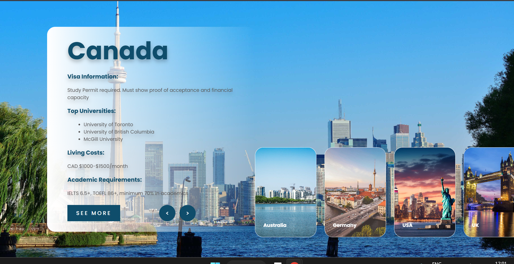

# 🌍 Study Abroad Guide

A simple and modern website that helps students explore study opportunities in countries like Canada, Australia, Germany, USA, and the UK. It provides key details such as visa requirements, top universities, living costs, and academic qualifications.

## ✨ Features

- Detailed study information for multiple countries
- Lists top universities in each country
- Estimates monthly living costs
- Displays visa and academic requirements
- Smooth navigation with responsive design

## 📌 Sample (Canada Section)

- **Visa Requirement**: Study Permit required. Must show proof of acceptance and financial capacity.
- **Top Universities**:
  - University of Toronto
  - University of British Columbia
  - McGill University
- **Living Costs**: CAD $1000–$1500/month
- **Academic Requirements**: IELTS 6.5+, TOEFL 86+, minimum 70% in academics

## 🛠 Tech Stack

- **HTML5** – Page structure and content
- **CSS3** – Styling and layout
- **JavaScript (Vanilla)** – Interactivity and transitions

